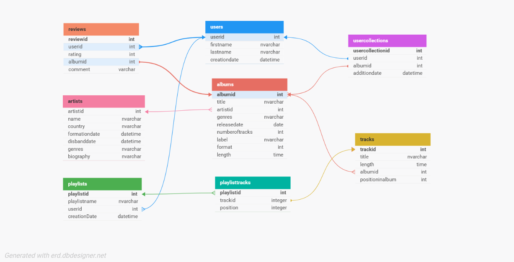

# MusicalCollectionWebApi

This is a simple ASP.NET MusicalCollection Web API
The task was:

4. Створити додаток «Музична колекція»
Розробити додаток для ведення та управління музичною колекцією користувача, який
дозволяє додавати, сортувати, шукати та переглядати інформацію про музичні альбоми та
виконавців. Додаток має підтримувати категоризацію альбомів, рейтингову систему та
можливість створення персональних списків.
Необхідно зберігати наступну інформацію:

- **Альбоми**: назва, виконавець, жанр, рік випуску, кількість треків, лейбл, формат (CD, вініл, цифровий).
- **Треки**: назва, тривалість, альбом, номер у списку, автор музики, автор тексту.
- **Виконавці**: ім'я/назва гурту, країна, активність (роки діяльності), жанри, біографія.
- **Колекція користувача**: перелік альбомів, дата додавання, статус (куплено, бажане).
- **Рейтинги та відгуки**: користувач, альбом, оцінка (1-5 зірок), коментар.
- **Списки відтворення**: назва списку, автор, перелік треків, дата створення.

### DB diagram

For better view go to [DB designer](https://dbdesigner.page.link/GN9LRu7Tjwbm7Zhc8)!

